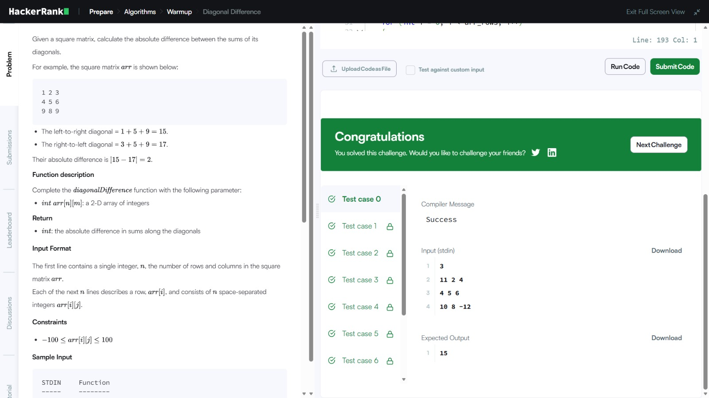
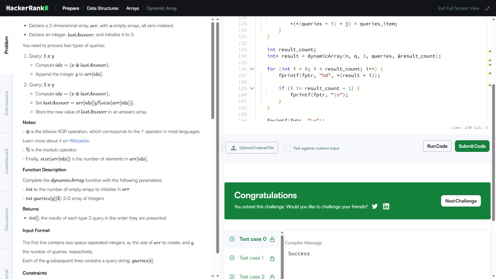
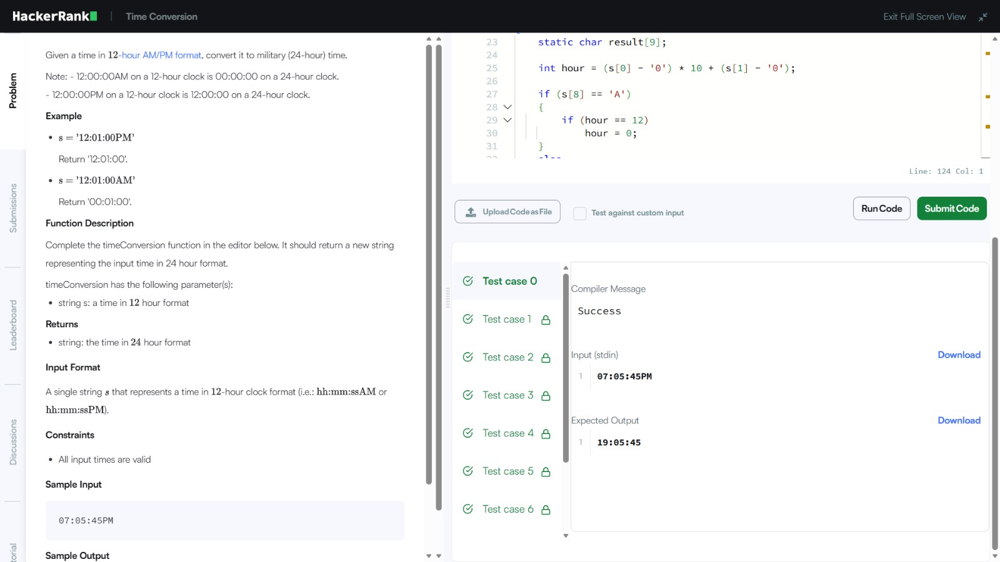
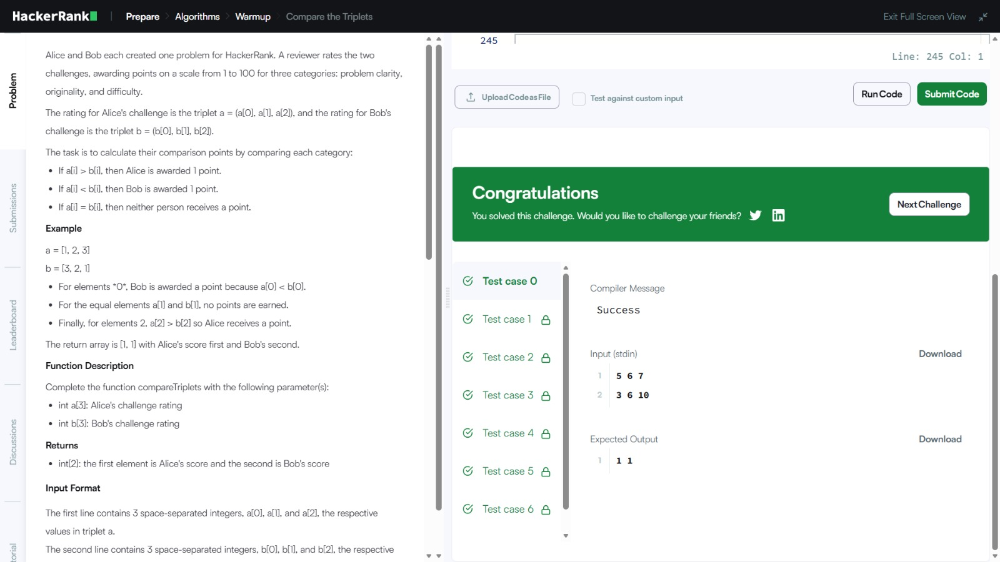
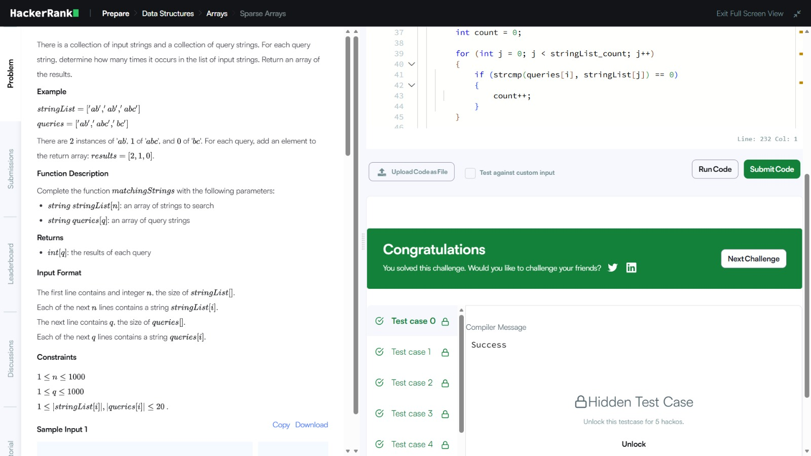

# HackerRank Algorithmic Problem-Solving

**Name:** ADITTHYA S S  
**SRN:** R25EF012  
**Course:** B.Tech CSE  
**Semester:** 3rd Semester

This repository contains my solutions for **Activity 8: HackerRank Algorithmic Problem-Solving & Portfolio Integration**. All solutions are written in C and include local test cases for practice before submission to HackerRank.

## Table of Contents

1. [Diagonal Difference](diagonal-difference/01-diagonal-difference.md)
2. [Dynamic Array](dynamic-array/02-dynamic-array.md)
3. [Time Conversion](time-conversion/03-time-conversion.md)
4. [Compare the Triplets](compare-the-triplets/04-compare-the-triplets.md)
5. [Sparse Arrays](sparse-arrays/05-sparse-arrays.md)

## Solution Screenshots

### 1. Diagonal Difference

### 2. Dynamic Array

### 3. Time Conversion

### 4. Compare the Triplets

### 5. Sparse Arrays

## HackerRank Portfolio

- **HackerRank Profile:** [(https://www.hackerrank.com/profile/aditthyass18)]
- **Problem Solving / Language Badge:** [EARNING BADGE](Badge.jpeg)

## Complexity Summary

| Problem | Time Complexity | Space Complexity |
|---|---|---|
| Diagonal Difference | O(N) | O(1) |
| Dynamic Array | O(N + Q) | O(N) |
| Time Conversion | O(1) | O(1) |
| Compare the Triplets | O(1) | O(1) |
| Sparse Arrays | O(N + Q) | O(N) |

> HackerRank profile details, badges, and submission results will be added only after they are available.
